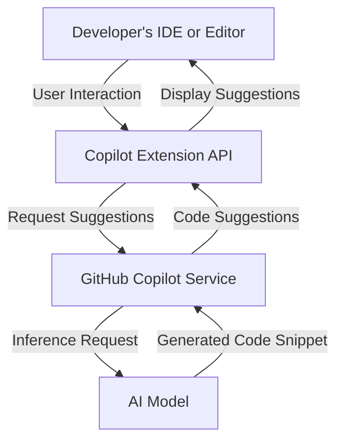
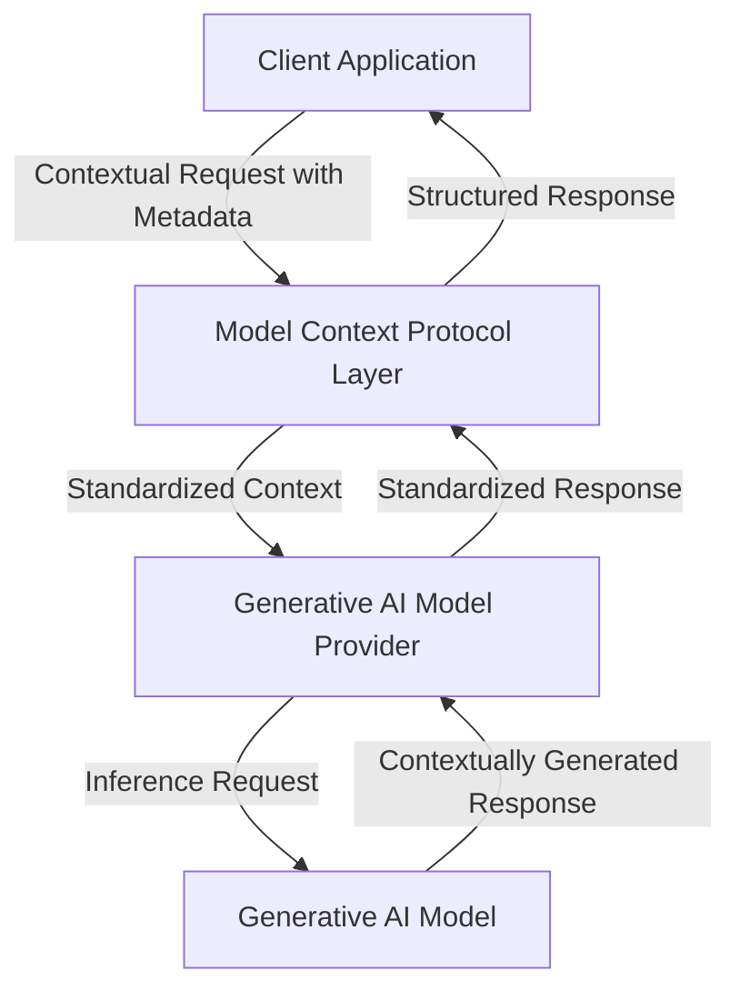

# GitHub Copilot Extensions and Model Context Protocol (MCP)
GitHub Copilot Extensions and Model Context Protocol (MCP) indeed share some similarities, as both are designed to enhance developer productivity, integrate AI-powered coding assistance into workflows, and streamline interaction between developers and AI models. However, there are important differences in their objectives, approaches, and capabilities.

Here's a detailed comparison:

---

## 📌 Overview of Each

### GitHub Copilot Extensions
GitHub Copilot Extensions are integrations or plugins built to enhance the functionality of GitHub Copilot. GitHub Copilot itself is an AI-driven pair programmer that suggests code snippets, tests, documentation, and entire functions directly in your IDE. With Copilot Extensions, developers can extend these capabilities, integrate Copilot-powered suggestions into specific workflows or tools, and customize their development experience.

**Typical Use Cases:**
- Enhanced IDE support for specific programming languages or frameworks.
- Integrations with external services (CI/CD, testing frameworks, documentation tools).
- Improved context awareness and customization of Copilot suggestions based on project-specific rules or codebases.

---

### Model Context Protocol (MCP)
Model Context Protocol (MCP) is a standardized conceptual framework aimed at providing structured context and explicit metadata to generative AI models. MCP standardizes the way context is passed to an LLM or generative AI system, making it easier for models to interpret user intent, manage stateful interactions, and produce more precise, relevant, and contextually-aware responses.

**Typical Use Cases:**
- Providing clear context and metadata to generative models (e.g., user intent, roles, conversation history, domain context).
- Standardizing interactions between different model providers, clients, and applications.
- Managing structured interactions and advanced dialogue management with generative AI.

---

## 🛠️ Feature Comparisons and Differences

| Feature Aspect                      | GitHub Copilot Extensions                   | Model Context Protocol (MCP)              |
|-------------------------------------|---------------------------------------------|-------------------------------------------|
| **Primary Objective**               | Extend and customize AI-assisted coding workflows and IDE integration. | Standardize context passing and metadata handling between generative AI clients and models. |
| **Integration Approach**            | IDE extensions, plug-ins, APIs specific to GitHub Copilot and coding environments. | Protocol-based standard, focused on context and metadata structures for general AI interactions. |
| **Use Cases**                       | Code generation, completion, integration with developer tools and IDEs. | Generalized AI interaction, context management, dialogue management across various AI applications and use cases. |
| **Flexibility and Scope**           | Scoped specifically to coding assistance, IDE integration, and developer productivity scenarios. | More generalized and abstract, supporting various interactions across AI models beyond just code (e.g., chatbots, virtual assistants, workflows). |
| **Standardization and Openness**    | Driven by GitHub/Microsoft, focused on the Copilot ecosystem and related integrations. Extensions typically rely on GitHub's APIs and ecosystem. | MCP is protocol-driven, designed as a broadly-adoptable standard to ensure interoperability among multiple generative AI providers, clients, and platforms. |
| **Context and State Handling**      | Context handling is typically domain-specific (codebase context, programming languages, IDE context). State management is IDE- or session-scoped. | MCP explicitly manages structured context and metadata, allowing stateful interactions, user intent handling, and context-aware multi-turn interactions. |
| **Ecosystem and Community**         | Strong ecosystem around Copilot and Visual Studio Code, integrated closely with GitHub's developer community. | Emerging standardization effort, community-driven protocol adoption, aimed at interoperability across multiple AI providers and platforms. |

---

## 🚩 Key Differences Summarized

- **Scope**: GitHub Copilot Extensions specifically target the developer workflow and IDE integration, whereas MCP aims broadly at standardizing interactions between generative AI models and their clients across various domains—not just coding.
- **Context Handling**: Copilot Extensions primarily handle context related to code, IDE state, and project-specific data. MCP explicitly standardizes structured context and metadata, enabling stateful, multi-turn interactions and broader context handling beyond coding tasks.
- **Standardization and Openness**: Copilot Extensions are specifically built around GitHub Copilot's ecosystem. MCP is designed as a standard protocol to be adopted widely, potentially across various model providers and AI platforms.
- **Interoperability**: MCP explicitly aims to enable interoperability and consistent context handling across different generative models and providers, while Copilot Extensions focus solely on enhancing GitHub Copilot and associated workflows.

---

## 🎯 When to Choose Which?

- **Choose GitHub Copilot Extensions when:**
  - You're specifically enhancing developer productivity within coding and IDE environments.
  - You want tight integration with GitHub Copilot, VS Code, and GitHub itself.
  - Your goal is to leverage specific developer tools, frameworks, or languages.

- **Choose MCP when:**
  - You're developing generalized generative AI client applications beyond coding.
  - You need consistent structured context management, multi-turn interactions, and interoperability.
  - You're designing applications or services that leverage multiple generative AI providers and models.

---

## 🔖 Conclusion

While GitHub Copilot Extensions and MCP share high-level similarities in enabling AI-driven productivity enhancements, their differences lie in scope, context management, interoperability, and standardization approach. Copilot Extensions focus on developer productivity and coding assistance, while MCP is designed as a general-purpose standard for structured context and metadata interactions across generative AI ecosystems.

Understanding your specific use-case scenario and objectives will guide you toward choosing between these two technologies or leveraging both, potentially complementing each other in comprehensive AI-assisted workflows.

---

Certainly! Here are Mermaid diagrams illustrating simplified conceptual architectures for GitHub Copilot Extensions and Model Context Protocol (MCP).

### ① GitHub Copilot Extensions Architecture

### Explanation:
- The developer interacts directly with their IDE, triggering the Copilot extension.
- The extension communicates with the GitHub Copilot service through an extension API.
- GitHub Copilot invokes AI models behind-the-scenes to generate code suggestions.
- Suggestions flow back to the IDE via the extension API, providing inline recommendations.

---

### ② Model Context Protocol (MCP) Architecture

### Explanation:
- A client application sends structured contextual requests (including metadata) via the MCP layer.
- MCP standardizes the context and forwards the request to the generative AI provider.
- The provider invokes the appropriate AI model.
- AI-generated responses are passed back through the provider, standardized again by MCP, and finally delivered to the client.

---

### 📌 Key Differences Clarified by the Diagrams:
- **Copilot Extensions** are tightly integrated into IDE workflows, focusing primarily on developer tooling and interactions.
- **MCP** is a generalized protocol layer, designed to standardize interaction and context-passing for various generative AI applications (not just coding).

These diagrams highlight the architectural similarity (both mediate between clients and generative AI models) while also making their differences clear: Copilot Extensions focus on a specialized, IDE-integrated workflow, while MCP provides a standardized protocol applicable across multiple domains.

---

Yes, GitHub Copilot Extensions' integration within established marketplaces (GitHub Marketplace and Visual Studio Code Marketplace) can indeed provide significant advantages compared to the Model Context Protocol (MCP). Here’s a detailed breakdown of why these marketplaces represent a distinct advantage:

---

## 📦 Advantages of GitHub Copilot Extensions Marketplaces (GitHub & VSCode)

### 1. **Discoverability and Reach**
- **Built-in visibility**: Extensions listed on GitHub Marketplace and VSCode Marketplace benefit from direct exposure to millions of developers already actively using GitHub and VSCode.
- **Searchability & categorization**: Users can easily search, filter, and discover extensions based on language, framework, task, or popularity.

### 2. **Trust and Credibility**
- **Verified publisher status**: Extensions published on established marketplaces often go through verification and review, increasing user confidence.
- **Community reviews & ratings**: User feedback, ratings, and reviews provide transparency, credibility, and informed decision-making for potential users.

### 3. **Ease of Installation and Updates**
- **Seamless integration**: Extensions can be installed and updated directly from within the IDE (e.g., VSCode), without requiring manual installations.
- **Automatic version management**: Marketplaces handle extension updates automatically, ensuring users always have the latest features and security patches.

### 4. **Community and Ecosystem**
- **Established communities**: GitHub and VSCode marketplaces are backed by vibrant communities and ecosystems, fostering collaboration, community support, and continuous improvement.
- **Integration & interoperability**: Extensions can easily integrate with existing tools, workflows, CI/CD pipelines, and other developer infrastructure.

### 5. **Monetization Opportunities**
- **Revenue generation**: Publishers can offer free or paid extensions, subscription models, or various monetization strategies through GitHub Marketplace.
- **Billing integration**: GitHub Marketplace manages billing, invoicing, and subscriptions efficiently, simplifying monetization for developers.

---

## 📌 Comparison to MCP (Model Context Protocol)
MCP is primarily a standardized protocol designed to enable consistent interaction between generative AI models and client applications. It does **not inherently include any infrastructure or marketplace for distribution, discoverability, monetization, or community management**.

| Feature | GitHub Copilot Extensions | MCP |
|---------|---------------------------|-----|
| Marketplace Integration | ✅ Integrated with GitHub and VSCode Marketplaces | ❌ No built-in marketplace |
| Discoverability | ✅ High | ❌ Dependent on external platforms |
| Trust & Credibility | ✅ Verified, rated, reviewed | ❌ Protocol-level, no built-in trust or rating |
| Installation & Updates | ✅ Direct IDE integration, automatic management | ❌ Implementation-specific |
| Monetization | ✅ Built-in monetization via marketplace | ❌ No built-in monetization |
| Community | ✅ Active and established developer community | ❌ No inherent community, relies on external adoption |

---

## 🚩 Why Marketplaces are a Strong Advantage:
- **Immediate reach and adoption**: Extensions on GitHub or VSCode marketplace gain immediate visibility, helping developers quickly discover and adopt new tools.
- **Lower barrier of entry**: Developers can quickly install extensions directly within their IDE, encouraging experimentation and rapid adoption.
- **Feedback loops**: User ratings, reviews, and issues streamline the process of continuous improvement.
- **Monetization & growth**: Revenue opportunities can fuel further development and sustainability of extensions.

---

## 🎯 Conclusion
Yes, the availability of GitHub and VSCode Marketplace is a substantial advantage for GitHub Copilot Extensions over MCP. While MCP provides a valuable standardization protocol layer for model interaction, GitHub Copilot Extensions' deep marketplace integration provides powerful advantages, especially in terms of discoverability, ease of use, trust, community support, and monetization.

In short, the presence of established marketplaces significantly boosts the potential for widespread adoption, collaboration, and commercial success, making it a clear strategic advantage for GitHub Copilot Extensions.
