# Homeラボ向けKubernetesクラスタ設計書

## 1. 構成図
現在の環境を視覚化したMermaid図を以下に示します。このコードは [https://mermaid.live/](https://mermaid.live/) でレンダリング可能です。

```mermaid
graph TD
    A[インターネット] -->|WAN| B[ホームルーター<br>（既存 or 2.5Gbps対応）]
    B -->|LAN: 2.5Gbps| C[スイッチ<br>TP-Link TL-SG105-M2<br>5ポート 2.5Gbps]
    
    C -->|LAN: 2.5Gbps| D[GMKtec G3 Plus<br>マスターノード<br>IP: 192.168.1.10]
    C -->|LAN: 2.5Gbps| E[GMKtec G3 Plus<br>ワーカーノード1<br>IP: 192.168.1.11]
    C -->|LAN: 2.5Gbps| F[GMKtec G3 Plus<br>ワーカーノード2<br>IP: 192.168.1.12]
    
    D -->|電源| G[電源タップ<br>4口 サージ保護付き]
    E -->|電源| G
    F -->|電源| G
    C -->|電源| G

    subgraph Kubernetes Cluster - k3s
        subgraph Master Node
            D --> H[k3s Server<br>- API Server<br>- etcd<br>- Scheduler<br>- Controller Manager]
            H --> I[Ingress Controller<br>（Traefik）]
            H --> J[CoreDNS<br>DNSサーバー]
            H --> K[MetalLB Controller<br>ロードバランサー]
            H --> L[Local Path Provisioner<br>ストレージ管理]
            H --> M[Node Exporter<br>ノード監視]
            H --> V[vCluster<br>仮想クラスタ<br>- Namespace: vcluster-test]
            H --> X1[Crossplane<br>- Core Controller<br>- Provider: azure]
        end

        subgraph Worker Node 1
            E --> N[k3s Agent]
            N --> O[Pod: Nginx<br>Webサーバー]
            N --> P[Pod: Prometheus<br>モニタリング]
            N --> Q[Service: LoadBalancer<br>（MetalLB経由）]
            N --> R[Node Exporter<br>ノード監視]
            N --> S[PersistentVolume<br>256GB SSD]
        end

        subgraph Worker Node 2
            F --> T[k3s Agent]
            T --> U[Pod: Grafana<br>可視化ツール]
            T --> V2[Pod: Loki<br>ログ収集]
            T --> W[Service: ClusterIP]
            T --> X[Node Exporter<br>ノード監視]
            T --> Y[PersistentVolume<br>256GB SSD]
            T --> X3[Pod: Azurite<br>Azure Storage Emulator]
        end

        subgraph Virtual Cluster - vCluster
            V --> V3[vk3s Server<br>- API Server<br>- SQLite<br>- Scheduler]
            V3 --> V4[Pod: Test-App<br>実験用]
            V3 --> V5[Service: ClusterIP]
            V3 --> V6[Managed Resource<br>例: Blob Storage by Crossplane]
            V3 --> A1[Argo CD<br>- Server<br>- Application Controller]
            V3 --> A2[Argo Rollouts<br>- Rollout Controller]
            A1 --> A3[Git Repository<br>（外部 or ローカル）]
            A2 --> V4
            V3 --> D1[Dapr Control Plane<br>- Operator<br>- Sidecar Injector]
            V3 --> F1[Pod: Order Function<br>- Azure Functions<br>- Dapr Sidecar<br>- State: Azurite]
            V3 --> F2[Pod: Notify Function<br>- Azure Functions<br>- Dapr Sidecar<br>- State: Azurite]
        end

        H -->|制御| N
        H -->|制御| T
        H -->|制御| V
        I -->|トラフィック| O
        I -->|トラフィック| U
        K -->|トラフィック分散| Q
        J -->|名前解決| O
        J -->|名前解決| U
        J -->|名前解決| P
        J -->|名前解決| V2
        O -->|メトリクス| P
        P -->|データ| U
        V2 -->|ログ| U
        U -->|ストレージ| Y
        P -->|ストレージ| S
        L -->|PV提供| S
        L -->|PV提供| Y
        M -->|メトリクス| P
        R -->|メトリクス| P
        X -->|メトリクス| P
        V3 -->|内部通信| V4
        X1 -->|管理| V6
        X1 -->|Azure API通信| X3
        A1 -->|同期| V4
        A1 -->|同期| V5
        A1 -->|同期| F1
        A1 -->|同期| F2
        A2 -->|デプロイ戦略| V4
        A2 -->|デプロイ戦略| F1
        D1 -->|サイドカー注入| F1
        D1 -->|サイドカー注入| F2
        F1 -->|状態管理| X3
        F2 -->|状態管理| X3
    end
```

## 2. 構成要素

### ハードウェア
- **ノード**: GMKtec G3 Plus ×3（Intel N150、8GB RAM、256GB SSD、TDP 6W）
  - マスターノード（IP: 192.168.1.10）
  - ワーカーノード1（IP: 192.168.1.11）
  - ワーカーノード2（IP: 192.168.1.12）
- **ネットワーク**: TP-Link TL-SG105-M2（5ポート、2.5Gbpsスイッチ）、Cat 6ケーブル
- **電源**: 4口電源タップ（サージ保護付き）

### ソフトウェア（ホストクラスタ - k3s）
- **k3s Server**: Kubernetes制御プレーン（API Server、etcd、Scheduler、Controller Manager）
- **Ingress Controller (Traefik)**: 外部トラフィックをルーティング
- **CoreDNS**: クラスタ内DNS解決
- **MetalLB**: ローカルロードバランサー
- **Local Path Provisioner**: ローカルストレージの動的プロビジョニング
- **Node Exporter**: ノードリソースのモニタリング
- **Crossplane**: インフラ管理（Provider: azure、Azurite連携）
- **vCluster**: 仮想クラスタ（Namespace: vcluster-test）
- **Pod**: 
  - Nginx: Webサーバー（ワーカーノード1）
  - Prometheus: モニタリング（ワーカーノード1）
  - Grafana: 可視化（ワーカーノード2）
  - Loki: ログ収集（ワーカーノード2）
  - Azurite: Azure Storageエミュレーター（ワーカーノード2）

### ソフトウェア（仮想クラスタ - vCluster）
- **vk3s Server**: 仮想制御プレーン（API Server、SQLite、Scheduler）
- **Pod**: 
  - Test-App: 実験用アプリ
  - Order Function: Azure Functions（Daprサイドカー付き、Azurite状態管理）
  - Notify Function: Azure Functions（Daprサイドカー付き、Azurite状態管理）
- **Argo CD**: GitOpsによるデプロイ管理
- **Argo Rollouts**: カナリー/ブルーグリーンデプロイ
- **Dapr Control Plane**: マイクロサービスランタイム管理
- **Managed Resource**: Crossplaneで管理（例: Blob Storage）

## 3. 全体概要と効果

### 全体概要
この構成は、GMKtec G3 Plusの低消費電力ミニPCを活用したHomeラボ向けKubernetes環境です。k3sをベースにvClusterで仮想クラスタを構築し、CrossplaneでAzure風インフラを管理、Argo CD/RolloutsでGitOpsとデプロイ戦略を実現、DaprとAzure Functions Core Toolsでサーバーレス＋マイクロサービスアプリを運用します。Azuriteを組み込むことで、Azure Storageをローカルで模擬し、クラウドコストゼロで実践的な実験が可能です。

### 主な特徴
- **軽量性**: k3sとvClusterにより、リソース制約（8GB RAM）でも動作。
- **モジュラー性**: インフラ（Crossplane）、デプロイ（Argo）、アプリ（Dapr/Functions）が分離され、柔軟に拡張可能。
- **Azure模擬**: AzuriteとCrossplaneでAzure環境を再現。

### 効果
- **学習環境の充実**:
  - Kubernetes、GitOps、サーバーレス、マイクロサービスを一貫して体験。
- **コスト効率**:
  - 初期投資約7.3万円、年間電気代約1500円で運用可能。
- **実験の安全性**:
  - vClusterでアプリ開発を隔離し、ホストクラスタの安定性を維持。
- **実践的スキル**:
  - Azureネイティブな開発、インフラ管理、デプロイ戦略をHomeラボで習得。
- **可視性と管理性**:
  - Prometheus/Grafana/Lokiでモニタリングとログを一元管理。

## 4. 想定されるアプリケーションユースケース

### ユースケース1: サーバーレス注文処理システム
- **概要**: HTTPトリガーのOrder Functionが注文を受け付け、Azuriteに状態を保存。Notify Functionが注文を処理し、通知をログに記録。
- **利用方法**:
  - Core ToolsでFunctionsを開発、ローカルでDaprとテスト。
  - Argo CDでGitからデプロイ、Rolloutsでカナリー展開。
  - CrossplaneでAzuriteのBlobコンテナを管理。
- **効果**: サーバーレスとマイクロサービスの統合を学び、イベント駆動アプリの運用を体験。

### ユースケース2: モニタリングダッシュボード
- **概要**: PrometheusがFunctionsのメトリクスを収集し、Grafanaでリアルタイムダッシュボードを構築。
- **利用方法**:
  - DaprのメトリクスエンドポイントをPrometheusに統合。
  - Argo CDでGrafanaの設定を同期。
- **効果**: アプリのパフォーマンスを可視化し、運用スキルを向上。

### ユースケース3: GitOpsによるテスト環境構築
- **概要**: vCluster内で一時的なテスト環境を立ち上げ、Test-AppやFunctionsをデプロイ。
- **利用方法**:
  - CrossplaneでvCluster内のリソース（Namespaceなど）を動的生成。
  - Argo CDでGitからマニフェストを適用。
- **効果**: 隔離されたテスト環境で安全に実験し、GitOpsの利点を体感。

### ユースケース4: Azure Blob Storageを使ったコンテンツ配信
- **概要**: NginxがAzuriteのBlobから静的コンテンツを配信。
- **利用方法**:
  - CrossplaneでBlobコンテナを作成、DaprでNginxと連携。
  - MetalLBで外部IPを割り当て。
- **効果**: Azure Storageの模擬運用を学び、コンテンツ配信アプリを構築。

## 5. 注意点と今後の拡張性

### 注意点
- **リソース制約**: 8GB RAMでPod数を5〜7に制限。メモリ不足時は16GBモデルを検討。
- **Azureの限定的模擬**: Azuriteはストレージのみ対応。Service BusやFunctionsの完全模擬には追加ツールが必要。
- **設定の複雑さ**: 初回セットアップに時間と学習コストがかかる。

### 今後の拡張性
- **Azureサービス追加**: LocalStack for Azureの成熟を待つか、Cosmos DB Emulatorを追加。
- **ノード拡張**: スイッチの空きポートを活用し、ノードを増設。
- **セキュリティ強化**: Secret管理（Vaultなど）やネットワークポリシーを追加。

## 6. 結論
この設計書は、GMKtec G3 Plusを活用したHomeラボ向けKubernetes環境を包括的にまとめたものです。インフラ管理（Crossplane）、デプロイ（Argo）、アプリ開発（Dapr/Functions）を統合し、Azure風の模擬環境を低コストで実現しました。
